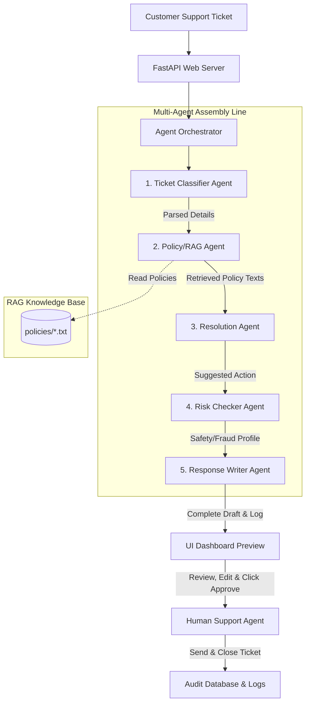

# AutoResolve AI: Multi-Agent Customer Support System

A complete, production-ready Generative AI support resolution product. **AutoResolve AI** automatically classifies incoming support tickets, retrieves relevant internal company policy bylaws (via local RAG),Suggests logical resolutions, audits safety and financial compliance risks, and drafts professional, empathetic email replies with full **Human-in-the-Loop** supervisor validation.

---

## 1. Problem Statement & Defined Users

### The Problem
Traditional customer support operations face a double-edged sword: simple chatbot widgets fail to understand complex inquiries (leading to frustrating customer experiences), while purely manual ticket backlogs result in high operational overhead, delayed response times (often 24–48 hours), and human support agent burnout. 

### The Solution
**AutoResolve AI** solves this by acting as an intelligent support co-pilot. When a ticket arrives, an autonomous team of specialized AI agents analyzes the message, retrieves the exact internal corporate rules (RAG), makes a mathematically and logically sound resolution choice, checks for compliance and safety risks, and drafts a human-ready reply. A human manager remains as the final supervisor, click-approving or tweaking drafts instantly.

### Defined Users
* **Customer Support Operators (Human-in-the-Loop)**: The primary users. They use the intuitive SaaS dashboard to review tickets, watch the live AI agent logs, make quick edits to drafts, and click to approve dispatch.
* **Support Operations Administrators**: Managers who edit standard company policies (like return windows or cancellation guidelines) in the backend to immediately update the AI team's retrieval database.
* **End Customers**: Benefit from immediate, highly accurate, and empathetic responses, reducing standard wait times from days to seconds.

---

## 2. Technical Stack & AI Tools

### Backend Architecture
* **Core Language**: Python 3.10+
* **Framework**: **FastAPI** — high-performance, asynchronous web API engine with auto-generated Swagger documentation (`/docs`).
* **Server**: **Uvicorn** — ASGI web server for rapid local development.
* **LLM Engine**: **Google GenAI SDK (`google-generativeai`)** driving **Gemini 1.5 Flash** for high reasoning speed and cost-efficient processing.
* **RAG Engine**: Local hybrid parser. Performs paragraph-based keyword pre-filtering on local text policy files, combined with in-context LLM clause extraction.
* **Integrity Fallback**: **Simulation Mode** — If the application runs without a `GEMINI_API_KEY`, it automatically runs a high-fidelity mock agent simulation instead of crashing, making evaluation seamless.

### Frontend Architecture
* **Framework**: **React 18** (bootstrapped with **Vite**).
* **Styling**: **Tailwind CSS v4** — utilizing dark-mode card themes, CSS-first configurations, and smooth responsive layout utilities.
* **Icons & Fonts**: FontAwesome 6 icons, Inter (body typography), and JetBrains Mono (monospaced developer terminal).

---

## 3. System Architecture & Multi-Agent Flow

The support ticket enters the FastAPI system and is coordinated sequentially by an orchestrator through five specialized agents:



### The 5 Specialized Agents

1. **Ticket Classifier Agent (Triage)**
   - **Role**: Analyzes the raw ticket text and extracts structural metadata.
   - **JSON Outputs**: `category` (Refund, Shipping, Subscription, Privacy, Other), `priority` (Low, Medium, High, Urgent), `sentiment` (Neutral, Frustrated, Angry, Happy), and entities (Order IDs, prices).

2. **Policy/RAG Agent (Knowledge Retrieval)**
   - **Role**: Receives the classified category, parses paragraphs in corresponding text policy files in `policies/`, ranks them by keyword overlap, and uses Gemini to extract exact governing clauses.
   - **Context Source**: Reads `refund_policy.txt`, `shipping_policy.txt`, `subscription_policy.txt`, and `privacy_policy.txt`.

3. **Resolution Agent (Business Logic)**
   - **Role**: Combines ticket facts and retrieved policy terms. Compares customer purchase dates, calculates refund amounts mathematically, and makes a logical resolution decision (Approved, Partial Approval, Rejected, or Escalated).

4. **Risk Checker Agent (Safety & Compliance)**
   - **Role**: Audits the proposed resolution for fraud indicators (e.g. signature verification present on a high-value $2000 dispute, legal threats, or account security risks). Outputs a glowing `risk_score` (Low, Medium, High).

5. **Response Writer Agent (Customer Relations)**
   - **Role**: Synthesizes the entire pipeline output to draft a warm, highly professional email reply quoting the policy guidelines, outlining the actions taken, and presenting active alternate options if rejected or escalated.

---

## 4. Folder Structure

```
GenAI_Project/
├── backend/
│   ├── config.py              # Environment configuration loader
│   ├── models.py              # Pydantic schemas validating inputs/outputs
│   ├── main.py                # FastAPI core router and agent orchestrator
│   ├── database/
│   │   └── mock_db.py         # Mock ticket database & persistent audit logger
│   └── agents/
│       ├── base.py            # Base agent wrapping Gemini API & Fallback Mock Mode
│       ├── classifier.py      # Ticket Classifier Agent logic
│       ├── rag.py             # Policy Retrieval RAG Agent logic
│       ├── resolver.py        # Logic resolution suggester agent logic
│       ├── risk_checker.py    # Risk Auditor and Fraud audit agent logic
│       └── response_writer.py # Customer relations email writer logic
├── frontend/                  # React + Tailwind CSS v4 Frontend (Vite)
│   ├── index.html             # HTML page template
│   ├── vite.config.js         # Vite configuration driving local backend proxy
│   └── src/
│       ├── main.jsx           # React app renderer
│       ├── App.jsx            # Core dashboard view controller
│       ├── index.css          # Tailwind imports & glassmorphism variables
│       └── components/
│           ├── Sidebar.jsx    # Stats side column and API indicator
│           ├── TicketQueue.jsx # Customer ticket feed with badges
│           ├── PipelineConsole.jsx # Live multi-agent visual console map
│           └── ResponseEditor.jsx  # Rich text draft reviewer & risk banner
├── policies/                 # Local RAG Knowledge Base text files
│   ├── refund_policy.txt
│   ├── shipping_policy.txt
│   ├── subscription_policy.txt
│   └── privacy_policy.txt
├── Notes.md                  # Study notes & real-world Sarah scenario
├── .env.example               # Environmental parameters example
├── requirements.txt           # Python library requirements list
└── README.md                  # Project master handbook
```

---

## 5. Installation & Setup Guide

Ensure you have **Python 3.10+** and **Node.js v18+** installed.

### Step 1: Clone and Set Up the Environment
Create a `.env` file in the project root directory:
```env
GEMINI_API_KEY=your_actual_gemini_api_key_from_google_ai_studio
```

### Step 2: Install Backend Packages & Launch FastAPI
In your root terminal:
```bash
# Install backend requirements
pip install -r requirements.txt

# Start the FastAPI server using Uvicorn
python -m uvicorn backend.main:app --reload
```
The API documentation will be available at `http://127.0.0.1:8000/docs`.

### Step 3: Install Frontend Packages & Launch React
In a **second terminal** window:
```bash
# Go into the React folder
cd frontend

# Install node dependencies
npm install

# Start the Vite React app
npm run dev
```
Open **`http://localhost:5173`** in your browser!

---

## 6. Project Limitations & Future Scope

### Limitations
1. **In-Memory Database**: Tickets are held in memory during runtime. Real-world scaling requires moving to Postgres or MongoDB.
2. **Text-Only Tickets**: The system processes text tickets. Invoices or packages submitted as photo attachments would require integrating Multimodal LLMs or OCR models.
3. **Keyword-Based Local Matching**: Standard vector similarity embeddings (e.g. `text-embedding-004`) should replace keyword paragraph rankings for massive policy databases exceeding 100 files.

### Future Scope
* **Live CRM Integrations**: Connecting API brokers directly to Zendesk, Salesforce, or Intercom queues to pull actual user tickets automatically.
* **Voice-to-Text Call Center Intake**: Integrating speech-to-text engines (e.g. Whisper API) so customers can dictate issues over a phone line, automatically feeding transcripts to the agent pipeline.
* **Deep Fraud Databases**: Connecting the Risk Auditor Agent directly to payment providers (like Stripe or PayPal) to cross-verify disputed balances in real-time.

---

## 7. Capstone Presentation: PPT Outline (Slide Blueprint)

Use this slide guide to assemble your PowerPoint file in minutes!

* **Slide 1: Title Slide**
  - **Title**: AutoResolve AI: Multi-Agent Support Resolution Platform
  - **Subtitle**: GenAI Capstone Project - Group [Your Names]
* **Slide 2: The Problem Statement**
  - High operational costs in customer support queues.
  - Slow response times (customers wait days) vs. simplistic keyword chatbots that fail on complex queries.
* **Slide 3: Our Solution (Vision & Concept)**
  - Introducing AutoResolve AI: an intelligent co-pilot dashboard.
  - Multi-agent collaboration to classify tickets, retrieve policies (RAG), suggest resolutions, audit compliance risk, and draft empathetic replies under human supervision.
* **Slide 4: System Architecture**
  - *Show the Mermaid workflow diagram.*
  - Highlight the flow: Ticket Intake ➔ Classifier ➔ RAG Policy Lookup ➔ Resolver ➔ Risk Audit ➔ Response Draft ➔ Human Approval.
* **Slide 5: RAG & Knowledge Retrieval**
  - How we do it: Keyword pre-filtering on company policy text files combined with Gemini context extraction.
  - Replaces general AI assumptions with 100% compliance matching official rules.
* **Slide 6: The Specialized Agent Assembly Line**
  - Highlight the 5 roles: Classifier (Triage), RAG Agent (Searcher), Resolver (Logician), Risk Auditor (Safety), and Response Writer (Writer).
* **Slide 7: Live Technical Demo (The Showstopper)**
  - *Explain the 3 demo cases present in the dashboard:*
    1. **Sarah (Refund)**: standard, safe return within 13 days ➔ Approved.
    2. **Marcus (Subscription refund dispute)**: 6 months billing cancel ➔ Cancel approved, historical cash refund rejected per policy. Store credit offered.
    3. **Ethan (Stolen $2000 items)**: high-value, signature-verified delivery conflict ➔ Flagged High Risk. Escalated to Tier 3.
* **Slide 8: Key Technical Achievements**
  - FastAPI async API + React/Tailwind v4 modular components.
  - Fallback "Simulation Mode" for zero-crash stability.
  - Secure Local persistent audit logging.
* **Slide 9: Limitations & Future Scope**
  - Relocate memory databases to standard databases, support OCR/images, and integrate voice intakes.
* **Slide 10: Conclusion & Q&A**
  - AutoResolve AI makes support pipelines faster, more accurate, and entirely auditable. Open for questions.
