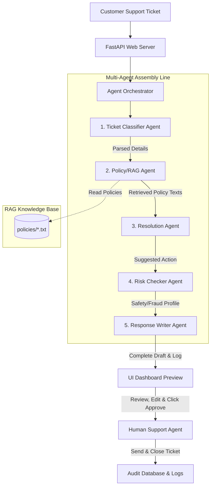

# Capstone Project Blueprint: AutoResolve AI (Multi-Agent Customer Support System)

This document outlines the end-to-end blueprint for building **AutoResolve AI**, a complete, production-grade GenAI product for the final capstone project. This project implements a multi-agent customer support pipeline with dynamic policy lookup (RAG), risk checking, and human-in-the-loop validation.

---

## 1. Problem Statement & User Persona

### The Problem
Traditional customer support systems are either simple keyword chatbots that fail on complex queries, or expensive manual queues that lead to long customer wait times and agent burnout. 

### The Solution
**AutoResolve AI** acts as an intelligent co-pilot. When a customer ticket arrives, an automated multi-agent team classifies it, retrieves the precise rules governing the issue (RAG), makes a calculated resolution recommendation, verifies safety and fraud risk, and drafts a human-ready reply.

### Defined Users
* **Customer Support Agents (The User)**: Support staff who review, edit, and click-approve automated drafts.
* **Support Administrators**: Operations managers who edit internal company policies to update support workflows immediately.
* **End Customers**: Receive fast, accurate, and empathetic replies.

---

## 2. Tech Stack & AI Tools

To ensure a 100% stable, lightning-fast, and modern presentation that is extremely easy to set up, we utilize a clean and powerful technical stack:

### Backend Architecture (API & Agents)
* **Core Language**: Python 3.10+
* **Web Framework**: **FastAPI** — high-performance, asynchronous web API engine with auto-generated Swagger documentation (`/docs`).
* **Server**: **Uvicorn** — lightning-fast ASGI web server.
* **LLM Engine**: **Google GenAI SDK (`google-genai` / `google-generativeai`)** — using the state-of-the-art **Gemini 2.5 Flash** / **Gemini 1.5 Flash** models for ultra-fast, cheap, and highly reasoning-capable processing.
* **RAG Engine (Knowledge Retrieval)**: Lightweight Python-based keyword & semantic similarity parser. It reads files directly from the `policies/` directory. No expensive external database is required, making the app entirely self-contained.
* **Environment Management**: `python-dotenv` for loading config parameters and `GEMINI_API_KEY` from a standard `.env` file.

### Frontend Architecture (Operations Dashboard)
* **Framework**: **React 18/19** (bootstrapped using **Vite** for lightning-fast compilation and Hot Module Replacement).
* **Styling**: **Tailwind CSS v4** (the latest state-of-the-art utility framework). It provides native support for dark-mode out of the box, responsive utility tags, CSS-first configurations, and ultra-fast build times.
* **Component Design**: Modular, atomic React components:
  - `Sidebar.jsx`: Quick brand indicators, KPI stats (total processed, high risk flagged, average resolution time).
  - `TicketQueue.jsx`: An elegant scrollable feed showing active tickets with priorities, statuses, and custom category badges.
  - `PipelineConsole.jsx`: A visual node-based network using Tailwind styling. Each node glows and spins based on agent activity states (Idle, Processing, Success, Error).
  - `ResponseEditor.jsx`: A premium, glassmorphic text editor showing the drafted response, custom edits, and a glowing risk warning banner.
* **State Management**: React `useState` and `useEffect` with asynchronous polling for streaming multi-agent log updates.

---

## 3. System Architecture & Multi-Agent Flow



### Specialized Agents & System Prompt Blueprints

1. **Ticket Classifier Agent**
   - **Role**: Analyzes the customer ticket.
   - **Outputs**: Extracts priority (Low/Med/High/Urgent), sentiment (Angry, Frustrated, Neutral, Happy), categories (Refund, Shipping, Cancellation, Tech-Bug), and key variables (Order ID, Tracking ID, Item Names).
   - **System Instruction snippet**: *"You are an expert ticket triage agent. Extract critical structured facts in JSON format. Do not guess."*

2. **Policy/RAG Agent**
   - **Role**: Receives the classified category and details, performs search queries on internal policy files, and extracts the exact paragraphs governing the customer's case.
   - **System Instruction snippet**: *"You are an internal database retrieval agent. Query policy documents and fetch only the direct rules that apply to this category."*

3. **Resolution Agent**
   - **Role**: Reviews ticket details and the retrieved policy rules. Performs math calculation (e.g., if ticket is 20 days since purchase and policy limit is 30, user is eligible), and returns a precise resolution decision.
   - **System Instruction snippet**: *"You are a precise corporate logic engine. Compare customer timeline and rules. Calculate refunds, replacement options, or escalation paths strictly matching company bylaws."*

4. **Risk Checker Agent**
   - **Role**: Scans for fraud patterns, unreasonable customer demands, repeated refund requests, or security flags (e.g. asking to change accounts without confirmation). Assigns a Risk Score (Low, Medium, High).
   - **System Instruction snippet**: *"You are a corporate risk and fraud officer. Audit the proposed resolution for potential compliance violations, fraud history, or high financial liabilities."*

5. **Response Writer Agent**
   - **Role**: Takes all outputs and drafts a customer-facing email that is warm, professional, clear, and specifically quotes the resolved action and policies.
   - **System Instruction snippet**: *"You are a master customer relations writer. Draft an email that is empathetic, direct, and structures the resolution steps clearly. Add placeholders for custom variables if needed."*

---

## 4. Project Directory Layout

```
GenAI_Project/
├── backend/
│   ├── __init__.py
│   ├── config.py              # Environment settings (dotenv loading)
│   ├── models.py              # Pydantic schemas (Ticket, Log, PipelineResult)
│   ├── main.py                # FastAPI core application & endpoints
│   ├── database/
│   │   ├── __init__.py
│   │   └── mock_db.py         # Mock ticket DB & persistent audit logger
│   └── agents/
│       ├── __init__.py
│       ├── base.py            # Base agent wrapper for Gemini SDK
│       ├── classifier.py      # Classifier Agent implementation
│       ├── rag.py             # RAG & Policy Retrieval Agent
│       ├── resolver.py        # Business logic resolver agent
│       ├── risk_checker.py    # Fraud & risk audit agent
│       └── response_writer.py # Email drafting agent
├── frontend/                  # React + Tailwind CSS v4 Frontend (Vite)
│   ├── package.json           # React package scripts & dependencies
│   ├── vite.config.js         # Vite configuration with proxy settings
│   ├── index.html             # React page entry
│   ├── src/
│   │   ├── main.jsx           # React app renderer
│   │   ├── App.jsx            # Main dashboard manager
│   │   ├── index.css          # Tailwind import directives & CSS variables
│   │   └── components/
│   │       ├── Sidebar.jsx    # Stats, branding, & controls
│   │       ├── TicketQueue.jsx # Customer ticket list feed
│   │       ├── PipelineConsole.jsx # Agent execution node visualization
│   │       └── ResponseEditor.jsx  # Rich text reviewer and risk analyzer
├── policies/
│   ├── refund_policy.txt      # Text database files for RAG lookup
│   ├── shipping_policy.txt
│   ├── subscription_policy.txt
│   └── privacy_policy.txt
├── Notes.md                   # Presentation guide & plain-English studies
├── .env.example               # Instructions for adding Gemini keys
├── requirements.txt           # Python dependency manifest
└── README.md                  # Beautiful student repository document
```

---

## 5. Development & Project Setup Guide

To get the backend and the React+Tailwind frontend up and running from scratch, follow these guided steps:

### Step 1: Create Directories
We will structure the root directory.

### Step 2: Install Python Backend Dependencies
In the root directory, create a `requirements.txt` file and run:
```bash
pip install -r requirements.txt
```

### Step 3: Initialize React+Tailwind Frontend
1. Create a `frontend` folder.
2. Initialize Vite with React inside `frontend/`:
   ```bash
   # We run npx to create the react project
   npx -y create-vite@latest frontend --template react
   ```
3. Inside `frontend/`, install Tailwind CSS v4:
   ```bash
   cd frontend
   npm install tailwindcss @tailwindcss/vite
   ```
4. Adjust config to import Tailwind and setup proxy so API calls easily route to `http://localhost:8000`.

---

## 6. Verification & Presentation Guide

### How to Run Locally (For you and your Teacher)
1. **Launch backend**:
   ```bash
   python -m uvicorn Backend.main:app --reload
   ```
2. **Launch React frontend** (in a separate terminal):
   ```bash
   cd frontend
   npm run dev
   ```
3. **Access the Dashboard**:
   Open `http://localhost:5173` in your web browser. All requests to `/api/*` will automatically proxy to the FastAPI backend!
